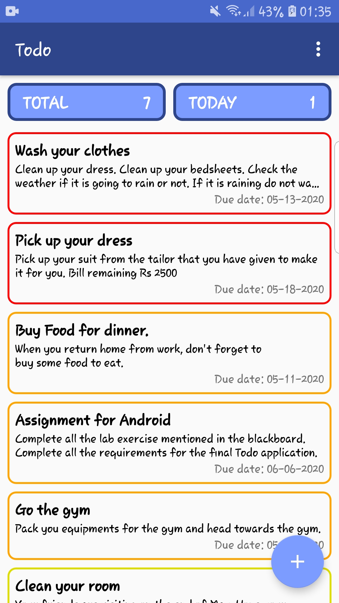
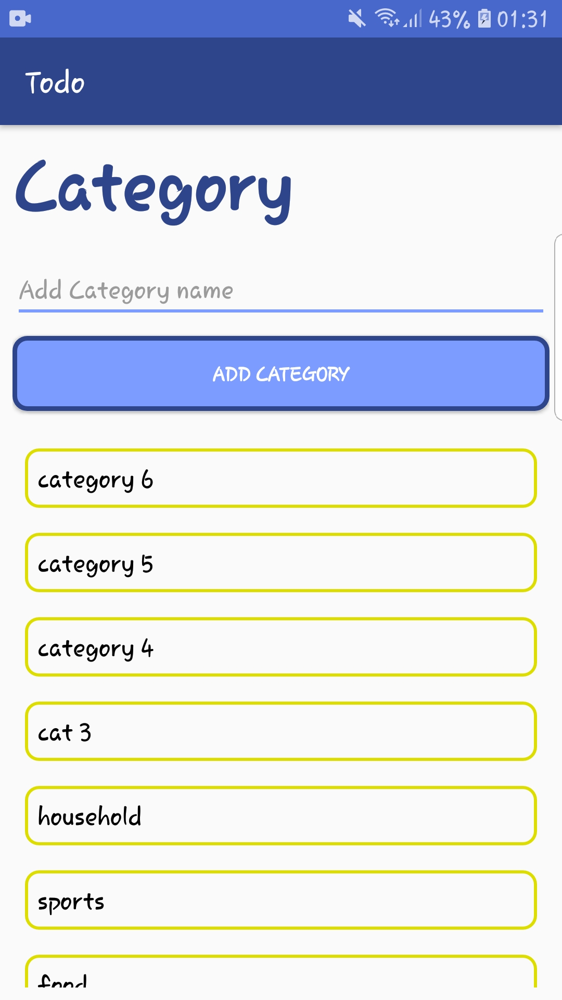
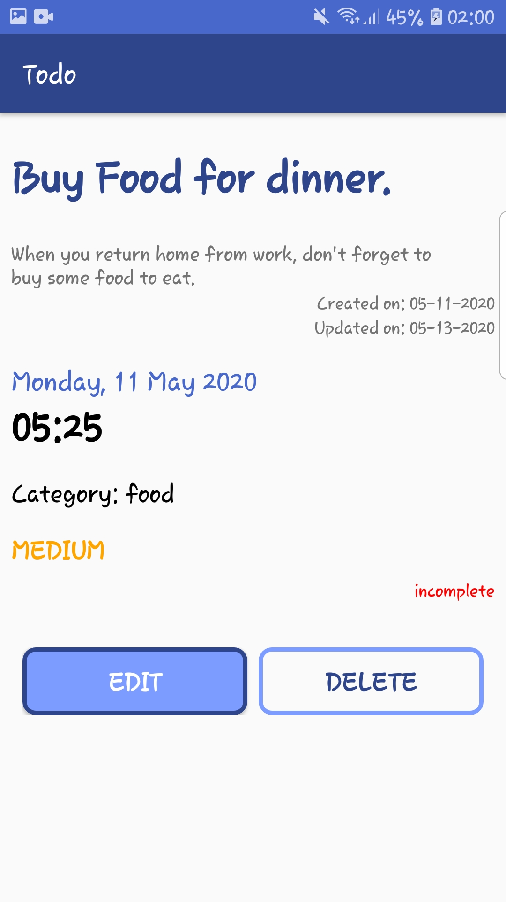
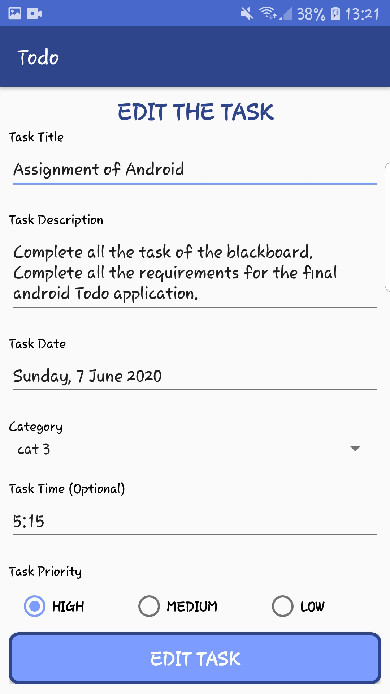

# Todo Application
### Rojan Bajracharya (c7190053)

---

### FRAMEWORK OF THE APPLICATION

---

### Entity Relationship Diagram (ERD)
This application consists of a database with 2 entities: Task and Category. The following diagram shows the ERD diagram of the databse.

---

### APP ICON
The app icon designed for the application is shown as below.

&nbsp;

---

### MY MOBILE APPLICATION

---

### PAGES IN MY APPLICATION
#### Task List

#### Category List

#### Single Task

#### Add Task

#### Edit Task

|Task List|Category List|Single Task|Add Task|Edit Task|
|:-:|:-:|:-:|:-:|:-:|
| || || |