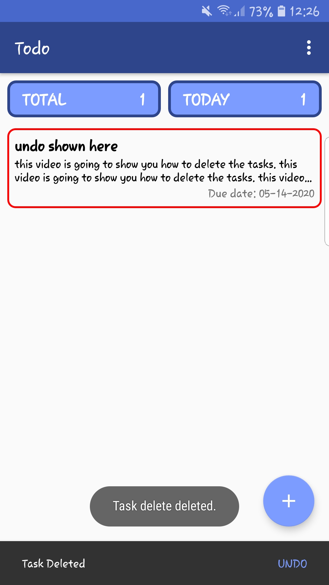
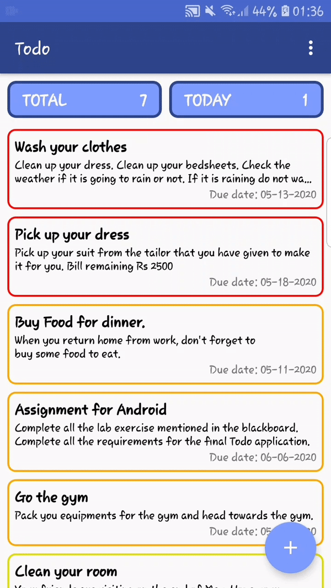
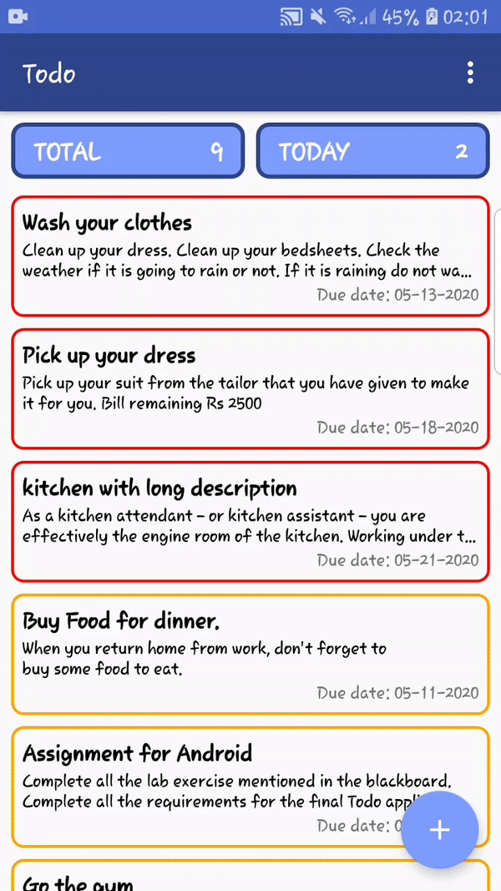
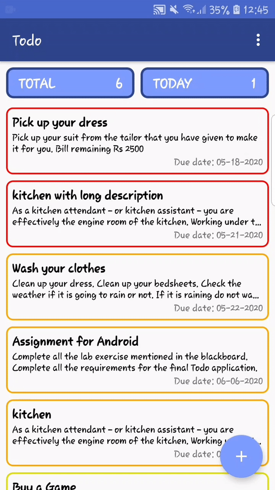
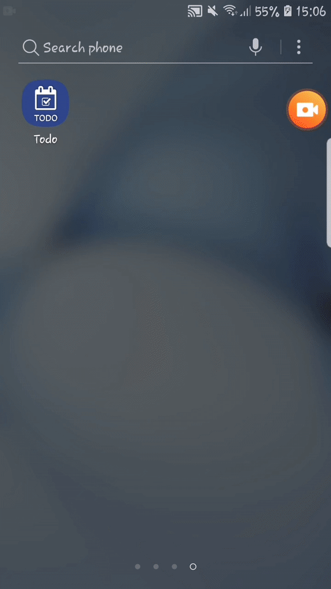
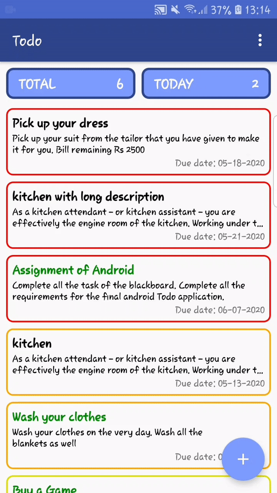
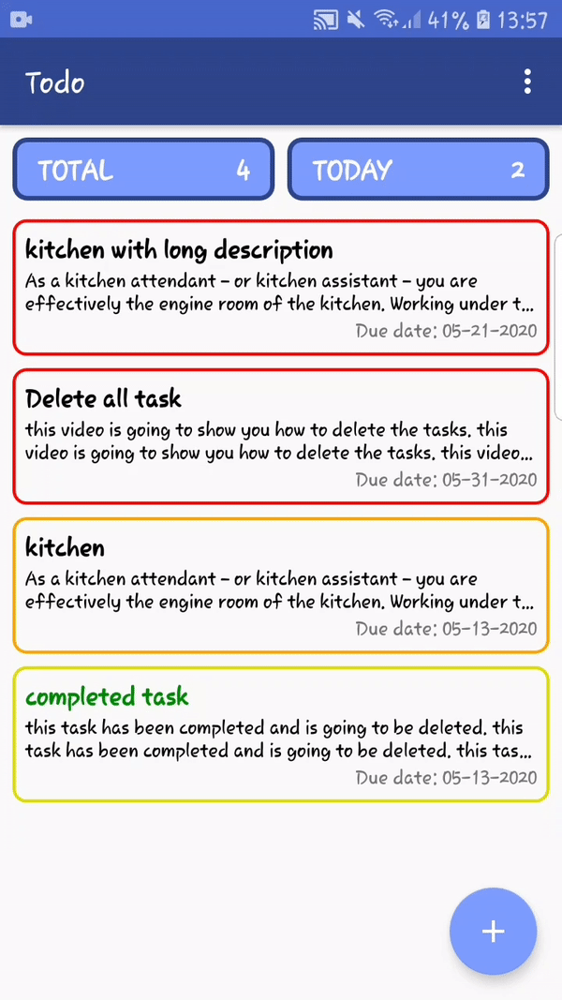
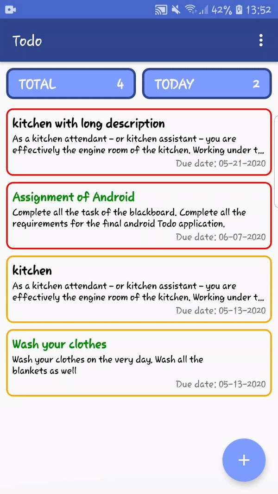
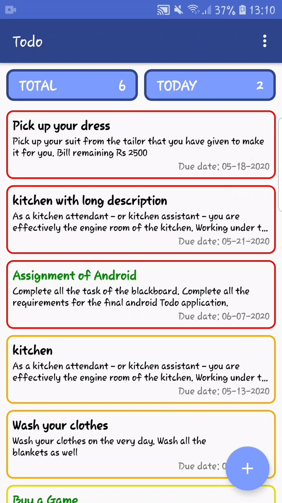

# Todo Application
### Rojan Bajracharya (c7190053)

---

### FRAMEWORK OF THE APPLICATION

---

### Entity Relationship Diagram (ERD)
This application consists of a database with 2 entities: Task and Category. The following diagram shows the ERD diagram of the databse.

---

### APP ICON
The app icon designed for the application is shown as below.

&nbsp;

---

### MY MOBILE APPLICATION

---

### PAGES IN MY APPLICATION
#### Task List

#### Category List

#### Single Task

#### Add Task

#### Edit Task

#### Undo Deleted Task

---

### FEATURES IN MY APPLICATION
#### **Basic Feature**
- Displaying Task List
- Displaying Single Task
- Adding Task
- Editing Task
- Deleting Task
- Marking Completed Task

#### **Additional Feature**
- Swiping in single view to display next task
- Launch screen
- Application Icon
- Category Entity in the database
  - Displaying Category List
  - Adding Category
  - Deleting Category (Deletes Task under it's Category)
- Long press a task to complete it
- Delete All
- Delete Completed
- Undo with the help of Snackbar

---

### **BASIC FEATURE**

#### Displaying Task

#### Displaying Single Task

#### Adding Task

#### Edit Task

#### Delete Task

#### Complete Task

---

### **ADDITIONAL FEATURE**
#### Swiping in single view to display next task

#### Launch screen

#### Application Icon

#### Displaying and Adding Category List

#### Deleting Category (Deletes Task under it's Category)

#### Long press a task to complete it

#### Delete All Task

#### Delete Completed

#### Undo with the help of Snackbar

|Task List|Category List|Single Task|Add Task|Edit Task|
|:-:|:-:|:-:|:-:|:-:|
| || || |